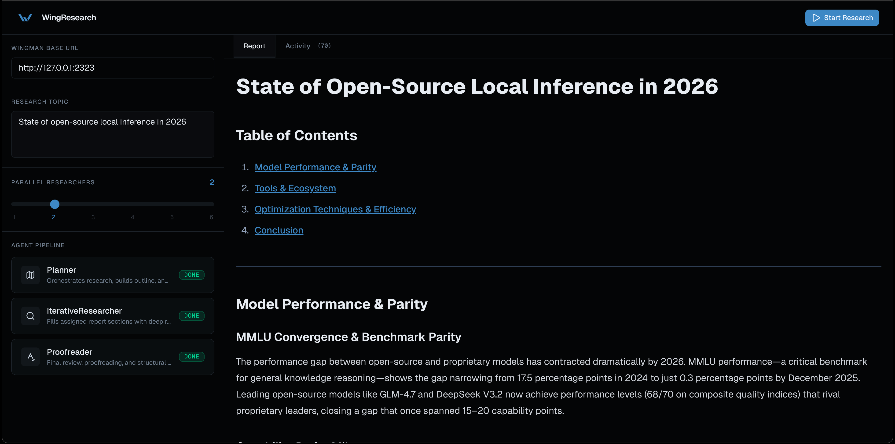

<p align="center">
    
</p>

# Wingman

Wingman is a highly performant agent orchestration framework written in Go. This project is heavily inspired by [OpenCode](https://opencode.ai)'s server approach to running agents but the goal is to achieve improved performance while also serving as an outlet for me to express my opinionated decisions about how agents should be run/composed together.

## Installation

### SDK

```bash
go get github.com/chaserensberger/wingman
```

### Server

```bash
curl -fsSL https://wingman.actor/install | bash
```

## Documentation

Check out the [docs site](https://wingman.actor/docs) for more detailed information about Wingman's primitives, architecture, and usage patterns. The docs site is also generated from [the docs folder](./resources/docs) if that's more your style.

## Clients

Frontends that use Wingman.

## WingResearch

Example deep research client I built for demo purposes. Showcases formations and fleet execution.

[./client/wui/wingresearch](./clients/wui/wingresearch)
<p align="center">
    
</p>

