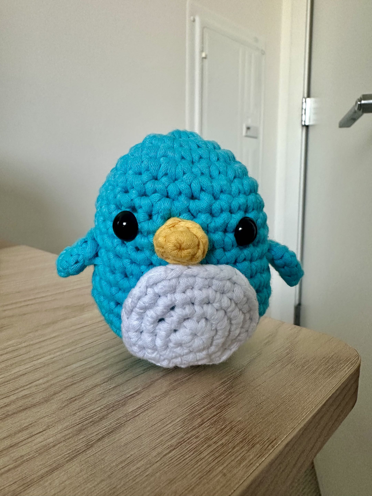

# Introduction

Wingman is an open-source, client-agnostic agent harness.

## What does client-agnostic mean?

Wingman is not coupled to a specific use case such as coding or answer generation. Build clients on top of its portable agent runtime.

So whether you're:

- Performing automatic triage
- Building a coding TUI
- Classifying emails
- Doing research

or solving another LLM-adjacent problem.

[Quick Start](/start-here/quickstart)

**Wingston:**

